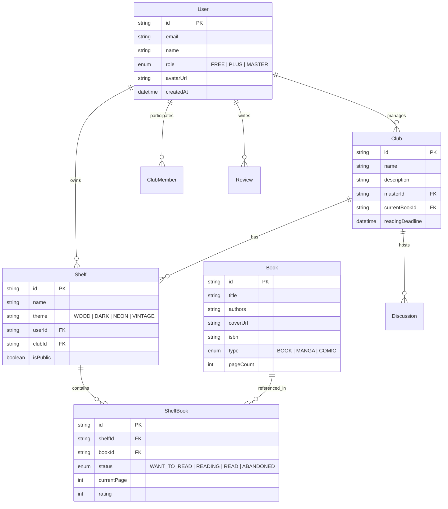

# 📚 Projeto: Meu Clube do Livro (Fullstack TypeScript)

> Aplicação comercial de rede social e gestão de clubes de leitura de livros, HQs e mangás com estantes virtuais 3D/interativas e modelo de monetização SaaS.

---

## 🎯 Objetivos do Projeto

1. **Domínio Técnico**: Capacitação em desenvolvimento Fullstack TypeScript moderno (Next.js App Router, React, Tailwind CSS, Prisma ORM, PostgreSQL, Server Actions e APIs RESTful).
2. **Desenvolvimento com IA**: Utilização de desenvolvimento impulsionado por IA (Antigravity CLI + Gemini) com boas práticas de arquitetura, padrões de projeto e Clean Code.
3. **Produto Comercial Rentável**: Lançamento de um produto SaaS com modelo Freemium / Subscrição com planos diferenciados para leitores e criadores de clubes (Leitor Master).

---

## 🏗️ Arquitetura e Tecnologias

### Stack Tecnológica

| Camada | Tecnologia | Descrição / Papel |
| :--- | :--- | :--- |
| **Framework Fullstack** | Next.js 14+ (App Router) | React Server Components, Server Actions, API Routes, SSR/SSG/ISR |
| **Linguagem** | TypeScript 5+ | Tipagem estática end-to-end (Frontend + Backend + Banco) |
| **Estilização & UI** | Tailwind CSS + Shadcn UI | Design moderno, responsivo e sistema de design acessível |
| **Animações & Estante 3D** | Framer Motion + CSS 3D | Animação realista das estantes, prateleiras, transições e livros inclináveis |
| **Banco de Dados** | PostgreSQL (Supabase / Neon) | Banco relacional escalável |
| **ORM** | Prisma ORM | Modelagem de dados fortemente tipada e migrações |
| **Autenticação** | NextAuth.js / Supabase Auth | Login social (Google) e Email/Senha com RBAC (Free, Plus, Master) |
| **Integração de Catálogo** | Google Books API + Jikan/MangaDex API | Busca e dados de livros, mangás e quadrinhos |
| **Pagamentos / SaaS** | Stripe API | Checkout de assinaturas, controle de planos e webhooks |

---

## 💎 Modelo de Negócio e Estratégia de Monetização

```
+-------------------------------------------------------------------------------+
|                             MEU CLUBE DO LIVRO                                |
+-------------------------------------------------------------------------------+
       |                                |                               |
       v                                v                               v
+------------------+          +------------------+          +-------------------+
|   Plano FREE     |          |  LEITOR PLUS     |          |   LEITOR MASTER   |
|   (R$ 0 / mês)   |          | (R$ 14,90 / mês) |          | (R$ 29,90 / mês)  |
+------------------+          +------------------+          +-------------------+
| • 2 Estantes     |          | • Estantes       |          | • Tudo do Plus    |
| • 30 obras/est.  |          |   Ilimitadas     |          | • Criar até 5     |
| • Entra em até 2 |          | • Obras          |          |   Clubes Ativos   |
|   clubes         |          |   Ilimitadas     |          | • Livro do Mês +  |
| • Tema Padrão    |          | • Temas 3D       |          |   Cronograma      |
|   (Madeira)      |          |   Exclusivos     |          | • Moderação       |
|                  |          | • Métricas &     |          | • Estante Própria |
|                  |          |   Metas          |          |   do Clube        |
+------------------+          +------------------+          +-------------------+
```

### Detalhamento dos Planos

1. **Plano FREE**
   - Ideal para novos usuários experimentarem a plataforma.
   - Recursos: Perfil básico, 2 estantes virtuais, máximo 30 livros por estante, participação em 2 clubes, tema clássico de estante de madeira, feed de avaliações.

2. **Plano LEITOR PLUS (R$ 14,90/mês ou R$ 149,00/ano)**
   - Voltado para leitores assíduos e colecionadores.
   - Recursos: Estantes ilimitadas, obras ilimitadas, acesso a catálogo de **Temas Visuais de Estante** (Futurista/Neon, Dark Gothic, Manga Studio, Biblioteca Vintage, Vidro Minimalista), estatísticas de leitura e gráficos de progresso.

3. **Plano LEITOR MASTER (R$ 29,90/mês ou R$ 299,00/ano)**
   - Voltado para BookTokers, organizadores de comunidades e líderes de grupos.
   - Recursos: Permissão para **criar e gerenciar até 5 Clubes de Leitura ativos**, definição do "Livro do Mês" com metas de leitura por capítulo/semana, estante coletiva do clube, enquetes de escolha da próxima obra e relatórios de engajamento do grupo.

---

## 📐 Regras de Negócio e Funcionalidades Principais

### 1. Autenticação e Perfis
- Cadastro de usuário com foto, bio, gêneros favoritos (Livros, Mangás, HQs) e redes sociais.
- Nível de assinatura vinculado ao usuário (`FREE`, `PLUS`, `MASTER`).
- Perfil público compartilhável (com estante virtual interativa).

### 2. Estantes Virtuais Interativas
- Representação visual em prateleiras com livros dispostos verticalmente/inclinados (estilo biblioteca real).
- Efeito de *hover* trazendo o livro para frente com animação Framer Motion.
- Clique no livro abre modal com sinopse, progresso de leitura (ex: "Página 120 de 350"), avaliações e nota (1 a 5 estrelas).
- Personalização de temas da estante conforme permissão do plano.

### 3. Busca e Catálogo Unificado
- Busca instantânea consumindo:
  - **Google Books API**: Livros de literatura geral, técnicos, HQs ocidentais.
  - **Jikan API (MyAnimeList) / MangaDex API**: Mangás, Manhwas e Light Novels.
- Opção de **Cadastro Manual**: Para edições raras, zines ou obras não encontradas nas APIs.

### 4. Clubes de Leitura (Leitor Master)
- Somente usuários **Leitor Master** podem criar novos clubes.
- O Leitor Master seleciona a obra em leitura atual e define a data limite de conclusão.
- Cronograma dividido por seções/capítulos para evitar *spoilers* (tópicos de discussão bloqueados até a data do capítulo).
- Estante coletiva do Clube ("Já lidos pelo Clube", "Leitura Atual", "Próximas Opções").

### 5. Feed Social e Interações
- Postagens de resenhas e notas.
- Histórico de progresso (ex: "João atualizou a leitura de 'Duna' para 50%").
- Curtidas, comentários e sistema de seguidores.

---

## 🗄️ Esquema do Banco de Dados (Prisma Schema Overview)



---

## 🚀 Roadmap de Desenvolvimento Phase-by-Phase

### Fase 1: Setup da Infraestrutura e Base do Projeto
- Configuração do Next.js 14 (App Router), Tailwind CSS, TypeScript e Shadcn UI.
- Configuração do Prisma ORM com PostgreSQL (Supabase/Neon).
- Autenticação de usuários (NextAuth.js com Credentials e Google OAuth).

### Fase 2: Módulo de Catalogo e Busca de Livros
- Integração com Google Books API e Jikan API (Mangás).
- Serviço de unificação de busca com debounce e paginação.
- Tela de detalhes do livro e cadastro manual de obras.

### Fase 3: Estantes Virtuais Interativas (Core UX)
- Componente de Estante Virtual 3D/Perspective com Tailwind CSS + Framer Motion.
- Criação e edição de estantes por perfil.
- Inclusão/remoção de livros, atualização de progresso de leitura e nota.
- Sistema de Temas (Tema Padrão e Temas VIP).

### Fase 4: Gestão de Clubes de Leitura (Leitor Master)
- Criação de clubes (com validação de permissão/plano).
- Definição do Livro do Mês e cronograma por capítulos.
- Fórum/Feed interno de discussão por clube com proteção de spoilers.

### Fase 5: Feed Social & Interações
- Feed global e feed de seguidos.
- Sistema de seguir/deixar de seguir usuários.
- Compartilhamento de estante via URL pública (OpenGraph dinâmico com capa da estante).

### Fase 6: Monetização & Assinaturas (Stripe)
- Integração com Stripe Billing / Checkout.
- Tabela de preços e tela de upgrade de plano.
- Webhooks para ativação/cancelamento automático de planos no banco de dados.
- Aplicar travas de limites (ex: impedir criação de +2 estantes se for FREE, bloquear criação de clube se não for MASTER).

---

## 📝 Próximos Passos Imediatos

1. Aprovação deste plano detalhado de implementação.
2. Inicialização do projeto Next.js com as dependências base (`prisma`, `tailwind`, `framer-motion`, `lucide-react`, `shadcn/ui`).
3. Criação da estrutura de pastas do projeto seguindo Clean Architecture.
